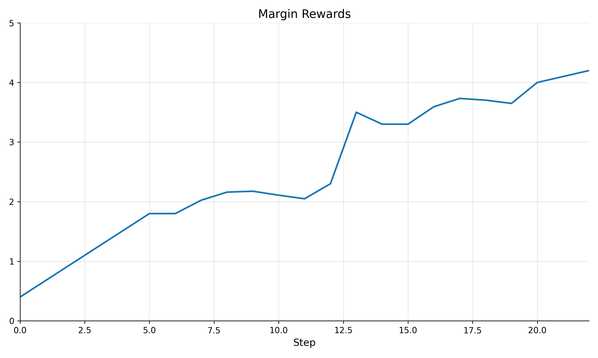

# ППР Boost

_MISIS x BGITU team_

Team Members:

1. **Виктория Гайлитис** - Backend
2. **Дарья Короленко** - Design
3. **Ильдар Ишбулатов** - Frontend
4. **Кирилл Рыжичкин** - ML Engineer

Презентация: [открыть]()

## Кейс "Assistant AI"

> Необходимо Разработать персонального помощника, интегрированного в личный кабинет и/или мобильное приложение, который помогает пользователям искать нужную информацию и решать технические вопросы.

## Предложенное решение

### Блок-схема Userflow

будет потом

### Блок-схема Adminflow

будет потом

## Запрос к боту

Поддерживаем:

- текстовый ввод
- голосовой ввод
- вложения:
  - pdf
  - word (doc, docx)
  - powerpoint (pptx)
  - table (csv, xls, xlsx)
  - html (html, htm)
  - markdown (md)
  - xml
  - json
  - audio (mp3)
  - image (png, jpg)
  - url
- флаг рассуждения (reasoning)

## Классификация запросов

Мы [разбили]() запросы на 50 категорий, из которых 11 родительских и 39 листовых (одна из родительских - UNK, для тех случаев, когда запрос не относится ни к одной из категорий):

Далее в дело вступает двустадийная классификация:

- на первом шаге определяем категорию 1 уровня
- на втором шаге определяем категорию 2 уровня
- если на первом шаге была определена категория UNK, то второй уровень не определяем
- классифицируем при помощи локального `Qwen/Qwen2.5-14B-Instruct`

В случае если категория первого уровня UNK - направляем пользователя в поддержку. Иначе - классический сценарий общения с ботом. Также все результаты классификации логируются и доступны для анализа в админской панели.

Код классификатора: [открыть]()

## RAG чат-бот

- по умолчанию работаем с 4 pdf
- поддержка стриминга
- есть выбор модели и ретривера с huggingface
- поддержка большого количества форматов данных (см. выше в списке вложений)
- поддержка рассуждений (reasoning)
- локальная модель (по умолчанию дообученная под домен `gemma2-9b-it-4bit`, также можно выбрать любаю претрейн модель с `huggingface`)
- загрузка новых источников в индекс (расширение базы знаний)
- удаление источников из индекса
- выбор роли ассистента (например, "помощник", "знаток личного кабинета", "знаток ППР" и т.д.) с уже заготовленными системными промптами под эти роли

Код чатбота: [открыть]()

## Ответ модели

- сам конкретный ответ на поставленный вопрос
- источник, на который ссылаемся
  - файл
  - страница
  - цитата
- в случае выбора режима рассуждений также предоставляем рассуждения модели

## Дополнительные возможности пользователя

- оценка ответа модели (от 1 до 5, также можно написать развернутый фидбек при желании)
- выбор роли (например, "помощник", "знаток личного кабинета", "знаток ППР" и т.д.)
- удаление чатов
- просмотр истории чатов

## Админские возможности: статистки по категориям

- все запросы по данной категории
- популярность категорий
- средний рейтинг ответов по категории

Данные статистики можно посмотреть для категории любого уровня в виде удобных интерактивных дашбордов.

## Админские возможности: статистки по оценкам

- распределение оценок в общем
- распределение оценок по категории
  = просмотр троек (вопрос, ответ модели, рейтинг от 1 до 5)

## Админские возможности: песочница тестов

- выбор глобальной конфигурации (модель + ретривер) - она применяется для юзеров
- далее для конфигурации будут собираться ранее указанные статистики (по оценкам и по категориям)
- данную операцию можно повторять для множества конфигураций, и в итоге будет получена структура вида {конфигурация: ее метрики}
- далее с помощью [байесовских методов]() проводим анализ и предлагаем лучшую конфигурацию, а также ранжируем все конфигурации
- даем множество интерактивных дашбордов и таблиц для сравнительного анализа конфигураций

## Админские возможности: пост-трейн модели

Мы собираем всю эту статистику оценок, однако остается вопрос - `зачем`?

Ответ: главную пользу из этих оценок мы извлекаем для RLHF дообучения LLM на фидбеке пользователей!

Для этого используем [Kahneman-Tversky Optimization (KTO)](https://arxiv.org/pdf/2402.01306):

- оценки 1, 2 мы считаем за False (плохой ответ)
- оценки 4, 5 мы считаем за True (хороший ответ)
- оценку 3 пропускаем

Мы своими силам собрали небольшой датасет из 86 строк (сами оценивали ответы), чтобы провалидировать этот подход и убедиться в его обоснованности. Для полноценного использования данного метода нужен большой корпус фидбеков пользователей, который можно обрести только при активном пользовании системой реальными пользователями.

Результаты пост-трейна на нашем игрушечном датасете:

Код пост-трейна: [открыть]()

## Админские возможности: автогенерация FAQ

Этот модуль позволяет автоматически сгруппировать похожие пользовательские вопросы и сгенерировать наглядный список часто задаваемых вопросов (FAQ) на основе уже имеющихся данных в админке.

- эмбеддер `intfloat/multilingual-e5-large-instruct`
- кластеризация `KMeans`
- для каждого кластера выбирается наиболее "центральный" вопрос (ближайший к центроиду) и его связанный ответ
- полученные FAQ-секции сортируются по количеству вхождений в кластере — сначала наиболее часто задаваемые вопросы

Код: [открыть]()

## Backend

- Микросервисная архитектура с FastAPI
- Админская панель с Django
- База данных PostgreSQL
- Контейниризация с Docker
- CI/CD
- traefik
- nginx

## Frontend

- React
- SCSS
- Redux
- Адаптивная верстка

## Преимущества

- разделение на админа и рядового юзера
- использование локальные модели
- собственная дообученная под домен легковесная модель
- поддержка множества форматов вложений и голосового ввода помимо классического текстового
- поддержка режима рассуждения
- качественная иерархическая классификация запросов пользователей
- множество статистик по категориям и оценкам в админской панели
- песочница тестов
- пост-трейн на фидбеке пользователей
- кастомизация: выбор моделей, ретриверов, системных промптов, расширение/сужение базы знаний
- автогенерация FAQ на основе частозадаваемых вопросов пользователей
